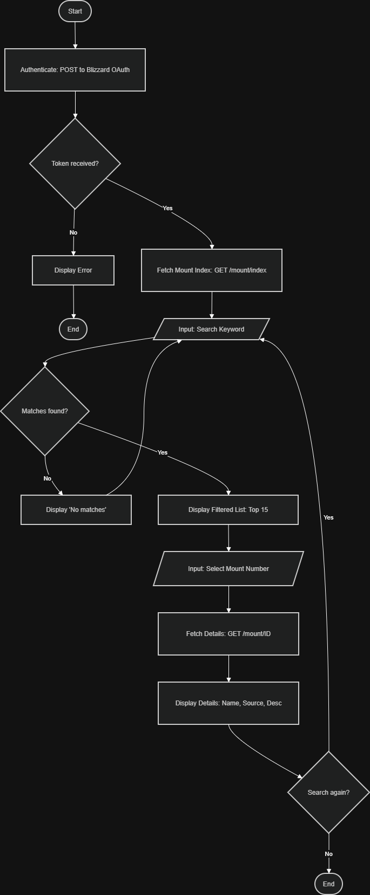

# WoW Mount Explorer 🐉

A Python-based command-line interface (CLI) tool that allows users to explore the vast library of mounts in World of Warcraft. This application fetches real-time data directly from the official Blizzard Game Data API.

## Project Logic & Data Flow
Below is a flowchart representing the application's logic, from authentication to the interactive search loop.



## Features
- **OAuth2 Authentication:** Securely retrieves Access Tokens from Blizzard's servers.
- **Advanced Search:** Filter through over 900+ mounts using keywords (e.g., "Drake", "Proto").
- **Detailed Data Extraction:** View unique descriptions, source information, and IDs.
- **Session Timestamps:** Displays exactly when the search session started.
- **Robust Error Handling:** Validates user input to prevent crashes during selection.
- **Interactive Loop:** User-friendly interface that allows for continuous searching.

## Data Source & Attribution
This application uses the **Blizzard Game Data API**. All World of Warcraft data is the property of Blizzard Entertainment.
- **Source:** [Blizzard Battle.net Developer Portal](https://develop.battle.net/)

## Installation & Setup

### 1. Prerequisites
- Python 3.10 or higher.
- A Blizzard Developer account with a Client ID and Secret.

### 2. Environment Configuration
Create a `.env` file in the root directory:
```env
CLIENT_ID=your_id_here
CLIENT_SECRET=your_secret_here